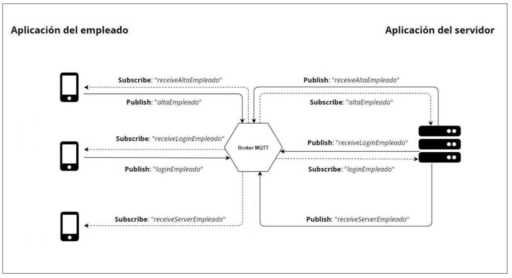

# FaceAccess Employee

Aplicación del empleado.

## *Implementación*

Para el desarrollo del proyecto se ha empleado el framework multiplataforma Flutter.

La premisa de esta aplicación es que el empleado puede controlar en todo momento los diferentes accesos al establecimiento con el sistema **FaceAccess** instalado.

Esta aplicación se conecta con el servidor central mediante MQTT, y se pone a la escucha de cualquier novedad respecto a los accesos.

La siguiente imagen representa la comunicación entre esta aplicación y el servidor.

<figure>
  
</figure>

## *Imágenes de la aplicación móvil*

<figure>
  
</figure>

<figure>
  
</figure>
